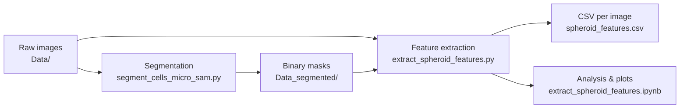

# Hepatic spheroid feature extraction

Pipeline for segmenting HEPG spheroid microscopy images and extracting quantitative features from the masked region. Designed for time-course studies (e.g. **24h** and **48h**) with **control** folders compared against treated conditions.

## Overview



| Step | Script / notebook | Output |
|------|-------------------|--------|
| 1. Segment spheroids | `segment_cells_micro_sam.py` | Binary `.tif` masks (255 = spheroid) |
| 2. Extract features | `extract_spheroid_features.py` | `spheroid_features.csv` |
| 3. Compare conditions | `extract_spheroid_features.ipynb` | Figures + summary tables |

Features are computed **only inside the segmentation mask** on the **original** (non-inverted) image intensities.

---

## Requirements

Python 3.8+ (3.10+ recommended for the notebook).

**Feature extraction** (`extract_spheroid_features.py`):

```bash
pip install numpy imageio scipy scikit-image
```

**Notebook** (visualizations):

```bash
pip install pandas matplotlib seaborn scikit-learn
```

**Segmentation** (`segment_cells_micro_sam.py`) additionally requires [micro-sam](https://github.com/computational-cell-analytics/micro-sam) and its dependencies. See the main [micro-sam installation guide](https://computational-cell-analytics.github.io/micro-sam/micro_sam.html#installation).

---

## Data layout

Original images and masks must share the **same relative paths** under two root folders:

```
Data/
├── 24h/
│   ├── Cont/
│   │   ├── image001.tif
│   │   └── ...
│   ├── PAR200/
│   └── ...
└── 48h/
    ├── Cont/
    └── ...

Data_segmented/
├── 24h/
│   ├── Cont/
│   │   ├── image001.tif    ← binary mask, same filename
│   │   └── ...
│   └── ...
```

- Input format: `.tif` (grayscale or RGB; RGB is converted to grayscale by averaging channels).
- Masks: single channel, **255 = spheroid**, **0 = background** (as written by `segment_cells_micro_sam.py`).

---

## Configuration

Edit paths at the top of each script/notebook. Example:

```python
INPUT_DIR  = Path(r"D:\ToxBox\Preprocessing_KIT\Data")
MASK_DIR   = Path(r"D:\ToxBox\Preprocessing_KIT\Data_segmented")
OUTPUT_CSV = Path(r"D:\ToxBox\Preprocessing_KIT\spheroid_features.csv")
```

**Reference controls** (notebook only) — exact folder paths relative to `Data/`:

```python
REFERENCE_FOLDERS = {
    "24h/Cont",
    "48h/Cont",
}
```

All other subfolders under `24h/` and `48h/` are treated as comparison conditions.

---

## Step 1 — Segmentation (optional if masks exist)

```bash
python segment_cells_micro_sam.py
```

Configure `INPUT_DIR`, `OUTPUT_DIR`, and `EMBEDDING_DIR` in that file. The script:

- Inverts images so dark spheroids appear bright for SAM.
- Keeps the largest round, compact region (eccentricity / solidity filters).
- Uses a texture-specific path for folders like `PAR200` / `PAR2000`.

Run once per dataset; masks are reused for feature extraction.

---

## Step 2 — Feature extraction (batch CSV)

```bash
python extract_spheroid_features.py
```

Produces **`spheroid_features.csv`** with one row per image:

| Column | Description |
|--------|-------------|
| `folder` | Subfolder path (e.g. `24h/PAR200`) |
| `file_name` | Image filename |
| *feature columns* | See table below |

Images without a matching mask are skipped. Empty masks yield `NaN` for features.

---

## Step 3 — Analysis notebook

Open and run:

```
extract_spheroid_features.ipynb
```

### Notebook sections

1. **Configuration** — paths, `REFERENCE_FOLDERS`, `PLOT_FEATURES`
2. **Extraction** — rebuilds CSV (or use the reload cell to read an existing CSV)
3. **Group setup** — assigns timepoint (`24h` / `48h`) and reference flags
4. **Visualizations** (saved under `spheroid_feature_figures/`):

| Output | Description |
|--------|-------------|
| `01_violin_per_folder.png` | Feature distributions per folder |
| `02_24h_vs_cont/*.png` | One boxplot per feature: all 24h folders vs **24h/Cont** (green) |
| `02_48h_vs_cont/*.png` | Same for 48h vs **48h/Cont** |
| `03_heatmap_folder_profiles.png` | Z-scored mean profile per folder |
| `04_pca_by_folder.png` | PCA of all features, colored by folder |
| `05_folder_distance_matrix.png` | Distance between folder mean profiles |
| `06_cohens_d_vs_cont.png` | Effect size vs timepoint control |
| `spheroid_features_summary_by_folder.csv` | Median / std / count per folder |

To re-plot without re-extracting, comment out the extraction cell and run:

```python
df = pd.read_csv(OUTPUT_CSV)
```

---

## Extracted features

All measurements are restricted to mask pixels unless noted.

### Size

| Feature | Description |
|---------|-------------|
| `area_px` | Spheroid area (pixels) |
| `perimeter_px` | Boundary length |
| `equivalent_diameter_px` | Diameter of circle with same area |
| `major_axis_length_px` | Major axis of fitted ellipse |
| `minor_axis_length_px` | Minor axis of fitted ellipse |
| `aspect_ratio` | Major / minor axis |

### Shape

| Feature | Description |
|---------|-------------|
| `eccentricity` | 0 = circle, →1 = elongated |
| `solidity` | Area / convex hull area (lower → holes or irregularity) |
| `extent` | Area / bounding-box area |
| `roundness` | \(4\pi \cdot \text{area} / \text{perimeter}^2\) |
| `compactness` | Inverse roundness measure |

### Position

| Feature | Description |
|---------|-------------|
| `bbox_width_px`, `bbox_height_px` | Bounding box size |
| `centroid_y`, `centroid_x` | Mask centroid |
| `mask_fraction_of_image` | Mask area / image area |

### Intensity (original image, inside mask)

| Feature | Description |
|---------|-------------|
| `mean_intensity`, `median_intensity` | Average brightness |
| `std_intensity` | Intensity spread |
| `min_intensity`, `max_intensity`, `intensity_range` | Dynamic range |
| `integrated_intensity` | Sum of pixel values |
| `intensity_cv` | Std / mean (heterogeneity) |
| `intensity_skewness`, `intensity_kurtosis` | Distribution shape |
| `intensity_entropy` | Normalized histogram entropy |

### Texture (inside mask)

| Feature | Description |
|---------|-------------|
| `laplacian_variance` | Fine-structure / sharpness |
| `local_std_mean` | Mean local std (7×7 window) |
| `mean_gradient_magnitude` | Mean Sobel gradient magnitude |

---

## Comparison logic (notebook)

- **Reference:** `24h/Cont` and `48h/Cont` — untreated controls at each timepoint.
- **Comparison:** every other folder under `24h/` or `48h/` (e.g. `24h/PAR200`, `48h/PAR2000`).
- Boxplots and Cohen's d use the **matching** control (24h conditions vs `24h/Cont`, 48h vs `48h/Cont`).

Adjust `REFERENCE_FOLDERS` if your control paths differ.

---

## Troubleshooting

| Issue | Suggestion |
|-------|------------|
| `uniform_filter() got an unexpected keyword argument 'footprint'` | Use `size=` not `footprint=` (fixed in current script). |
| `TypeError: unsupported operand type(s) for \|` | Python &lt; 3.10 in notebook; use updated notebook cells (no `str \| None`). |
| No reference folders matched | Check `REFERENCE_FOLDERS` match paths exactly (e.g. `24h/Cont`, not `24/Cont`). |
| All features `NaN` | Empty or missing mask; re-run segmentation. |
| Seaborn `palette` warning | Use `hue=` with `legend=False` (fixed in notebook boxplot cell). |

---

## Files in this workflow

| File | Purpose |
|------|---------|
| `segment_cells_micro_sam.py` | SAM-based spheroid segmentation |
| `extract_spheroid_features.py` | Batch feature extraction → CSV |
| `extract_spheroid_features.ipynb` | Extraction + folder comparisons + plots |
| `README_SPHEROID_FEATURES.md` | This document |

---

## Citation

Segmentation uses [micro-sam](https://github.com/computational-cell-analytics/micro-sam). If you use that component, cite the micro-sam publication listed in their repository.
