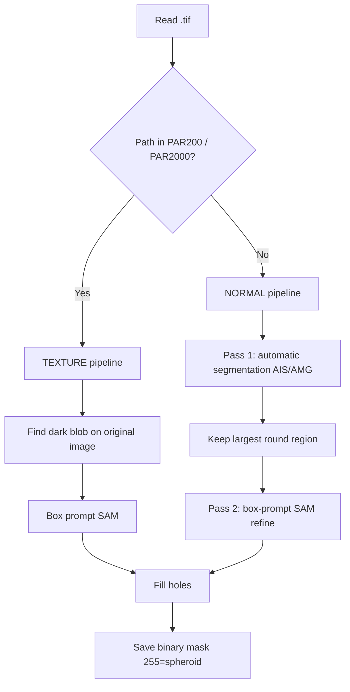

# Hepatic spheroid segmentation (micro-sam / SAM)

Batch scripts for segmenting **HEPG hepatic spheroids** in brightfield microscopy images. We build on **[µSAM (micro-sam)](https://github.com/computational-cell-analytics/micro-sam)** — *Segment Anything for Microscopy* — and add a custom two-pass pipeline tuned for dark, round spheroids on lighter backgrounds.

Related documentation:

- [micro-sam README](README.md) — installation, models, and upstream library
- [Feature extraction README](README_SPHEROID_FEATURES.md) — quantitative analysis from these masks

---

## Citation

These scripts **use** micro-sam as a library; they are **not** part of the official micro-sam repository. If you use them in a publication, please cite:

1. **µSAM (micro-sam)** — Nature Methods, 2024  
   Constantin Pape et al., *Segment Anything for microscopy*.  
   Paper: https://www.nature.com/articles/s41592-024-02580-4  
   Software: https://github.com/computational-cell-analytics/micro-sam  
   DOI: https://doi.org/10.5281/zenodo.7919746

2. **Segment Anything (SAM)** — original foundation model  
   Kirillov et al., *Segment Anything*, arXiv:2304.02643  
   https://arxiv.org/abs/2304.02643

Install and general usage of micro-sam: [official documentation](https://computational-cell-analytics.github.io/micro-sam/).

---

## Scripts in this workflow

| Script | Model | Automatic mode | Typical output folder |
|--------|--------|----------------|------------------------|
| **`segment_cells_micro_sam.py`** | `vit_b_lm` | **AIS** (micro-sam instance decoder) | `Data_segmented/` |
| **`segment_cells_sam.py`** | `vit_b` | **AMG** (plain SAM mask grid) | `SAM_Data_segmented/` |

Both scripts share the **same custom logic** (preprocessing, shape filters, texture folders, two-pass refinement). The difference is **which SAM backbone and automatic segmenter** micro-sam loads.

### Which script should I use?

- **`segment_cells_micro_sam.py`** (recommended for microscopy)  
  Uses the **light-microscopy–finetuned** checkpoint (`vit_b_lm`) and **AIS**, which is designed for cell-like objects in microscopy. This is the default for the ToxBox HEPG spheroid pipeline and feeds into `extract_spheroid_features.py`.

- **`segment_cells_sam.py`**  
  Uses the **generic SAM** checkpoint (`vit_b`) and **AMG** (automatic mask generator). Useful as a baseline comparison or when you want vanilla SAM behaviour without the microscopy decoder.

---

## What micro-sam provides (used in both scripts)

From the [micro-sam Python API](https://computational-cell-analytics.github.io/micro-sam/micro_sam.html):

| Import / function | Role in our scripts |
|-------------------|---------------------|
| `get_predictor_and_segmenter()` | Loads SAM predictor + automatic segmenter (AIS or AMG) |
| `automatic_instance_segmentation()` | **Pass 1** — automatic mask proposals on the full image |
| `segment_from_box()` | **Pass 2** — refine segmentation with a bounding-box prompt |
| `util.precompute_image_embeddings()` | Cache image embeddings in `.zarr` for faster box prompting |

We do **not** use the napari annotator or interactive tools; these are **batch, headless** pipelines over folder trees of `.tif` files.

---

## Custom pipeline (our code on top of micro-sam)

Microscopy spheroids are **darker than the background**, while SAM expects **bright foreground**. Every image is therefore **inverted** before embedding and segmentation (`preprocess_image`).



### Normal pipeline (most folders)

1. **Invert** image for SAM.
2. **Pass 1 — automatic segmentation**  
   - micro-sam: `automatic_instance_segmentation()`  
   - Parameters tuned for **one large object** (`min_size=50000`, etc.).
3. **Post-filter**  
   - Fill holes in each label.  
   - **`keep_largest_round_region()`** — keep a single spheroid using:
     - `MAX_ECCENTRICITY = 0.85`
     - `MIN_SOLIDITY = 0.40`
4. **Pass 2 — box refinement**  
   - Bounding box from Pass 1 → `segment_from_box()` with `NORMAL_BOX_EXTENSION = 0.20`.  
   - Accept refined mask if area ≥ 80% of Pass 1 (avoids collapsed masks).

### Texture pipeline (`PAR200`, `PAR2000`)

Textured backgrounds break automatic segmentation. For these folders:

1. **`find_dark_spheroid_box()`** on the **original** (non-inverted) image — darkest large blob via percentile threshold.
2. **Invert** and compute embeddings.
3. **Box-only SAM** with `TEXTURE_BOX_EXTENSION = 0.10` (tighter box than normal folders).

Folder names containing `PAR200` or `PAR2000` anywhere in the path trigger texture mode (`TEXTURE_FOLDERS`).

### Output format

- Binary `.tif`, same relative path as input under `OUTPUT_DIR`
- **255** = spheroid, **0** = background
- Embeddings cached as `.zarr` under `EMBEDDING_DIR` (reused on re-runs)

---

## Requirements

Install [micro-sam](https://computational-cell-analytics.github.io/micro-sam/micro_sam.html#installation) first (conda recommended):

```bash
conda create -n micro_sam -c conda-forge micro_sam
conda activate micro_sam
```

Additional packages used by the scripts:

```bash
pip install numpy imageio scipy scikit-image
```

GPU is optional; both scripts default to `device="cpu"`.

---

## Configuration

Edit the paths at the top of each script:

```python
INPUT_DIR     = Path(r".../Data")
OUTPUT_DIR    = Path(r".../Data_segmented")      # or SAM_Data_segmented
EMBEDDING_DIR = Path(r".../Data_embeddings")
```

### Tunable parameters

| Parameter | Default | Purpose |
|-----------|---------|---------|
| `MAX_ECCENTRICITY` | `0.85` | Reject elongated blobs |
| `MIN_SOLIDITY` | `0.40` | Reject irregular / holed shapes |
| `NORMAL_BOX_EXTENSION` | `0.20` | Expand box for Pass 2 (normal folders) |
| `TEXTURE_BOX_EXTENSION` | `0.10` | Expand box for texture folders |
| `TEXTURE_DARK_PERCENTILE` | `10` | Dark-pixel threshold (lower = stricter) |
| `TEXTURE_MIN_AREA` | `30000` | Minimum dark-blob area (pixels) |
| `TEXTURE_FOLDERS` | `{"PAR200", "PAR2000"}` | Folder names triggering texture mode |

### Model settings (do not mix between scripts)

**`segment_cells_micro_sam.py`:**

```python
predictor, segmenter = get_predictor_and_segmenter(
    model_type="vit_b_lm",
    segmentation_mode="ais",
    device="cpu",
)
```

**`segment_cells_sam.py`:**

```python
predictor, segmenter = get_predictor_and_segmenter(
    model_type="vit_b",
    segmentation_mode="amg",
    device="cpu",
)
```

---

## Data layout

```
Data/
├── 24h/
│   ├── Cont/
│   │   └── spheroid_001.tif
│   ├── PAR200/
│   └── ...
└── 48h/
    └── ...

Data_segmented/          ← created by segment_cells_micro_sam.py
├── 24h/
│   ├── Cont/
│   │   └── spheroid_001.tif   (binary mask)
│   └── ...
```

All `*.tif` files under `INPUT_DIR` are processed recursively; output mirrors the input tree.

---

## Usage

```bash
# Recommended: microscopy-finetuned model + AIS
python segment_cells_micro_sam.py

# Alternative: plain SAM + AMG
python segment_cells_sam.py
```

Progress is printed per image (candidate labels, areas, Pass 1 vs Pass 2). Existing output masks are overwritten (`unlink` before save).

**Next step:** run feature extraction on `Data` + `Data_segmented` — see [README_SPHEROID_FEATURES.md](README_SPHEROID_FEATURES.md).

---

## Troubleshooting

| Symptom | What to try |
|---------|-------------|
| No segmentation / empty mask | Lower `min_size` or AIS thresholds; check inversion (spheroid should be bright after preprocess). |
| Wrong object selected | Tighten `MAX_ECCENTRICITY` / `MIN_SOLIDITY`; increase `min_size`. |
| Texture folder: spheroid not found | Raise `TEXTURE_DARK_PERCENTILE` or lower `TEXTURE_MIN_AREA`. |
| Pass 2 shrinks mask too much | Increase `NORMAL_BOX_EXTENSION`; script keeps Pass 1 if refined area &lt; 80% of original. |
| Slow on CPU | Set `device="cuda"` if GPU available; embeddings are cached in `.zarr`. |
| Model download issues | Follow micro-sam install docs; first run downloads checkpoints. |

---

## File summary

| File | Description |
|------|-------------|
| `segment_cells_micro_sam.py` | Spheroid segmentation with **µSAM** (`vit_b_lm` + AIS) |
| `segment_cells_sam.py` | Spheroid segmentation with **plain SAM** (`vit_b` + AMG) |
| `README.md` | Upstream micro-sam project documentation |
| `README_SPHEROID_SEGMENTATION.md` | This document |
| `README_SPHEROID_FEATURES.md` | Feature extraction from masks |

---

## Acknowledgement

Segmentation is powered by **[µSAM](https://github.com/computational-cell-analytics/micro-sam)** (computational-cell-analytics) and **[Segment Anything](https://segment-anything.com/)** (Meta AI). Custom batch pipelines, shape filters, and texture handling are ToxBox/Preprocessing KIT additions for hepatic spheroid experiments.
